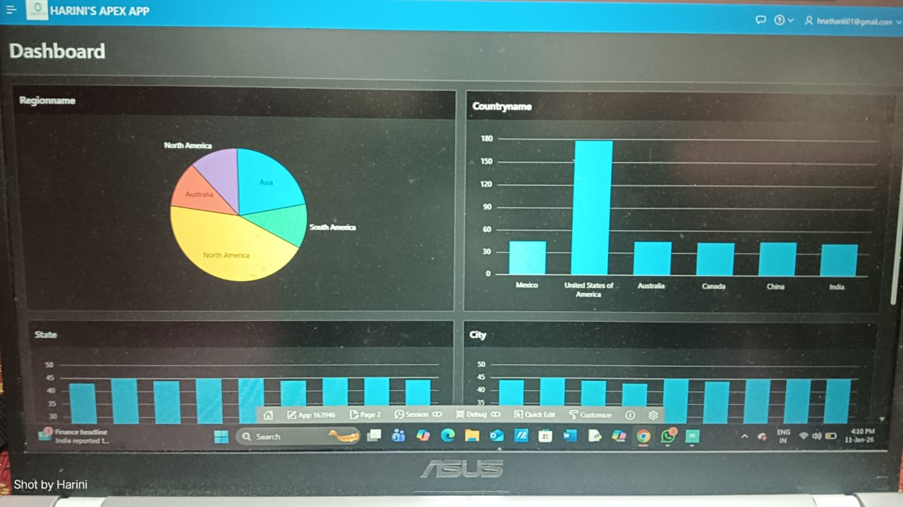
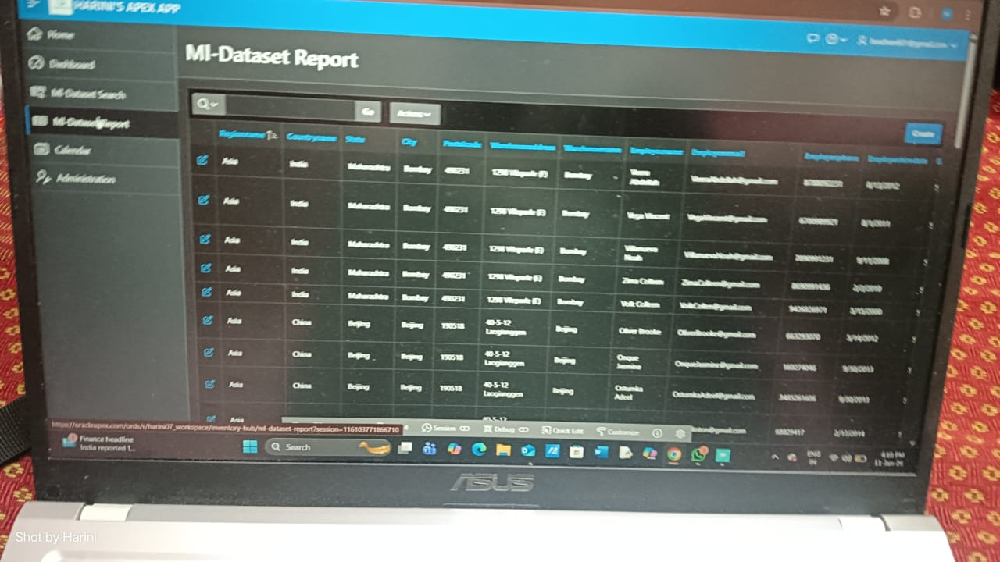
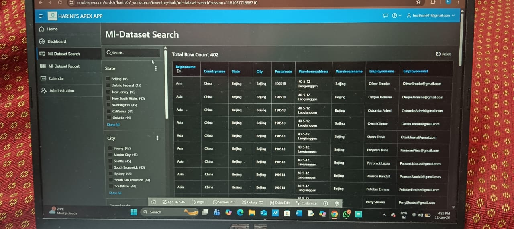
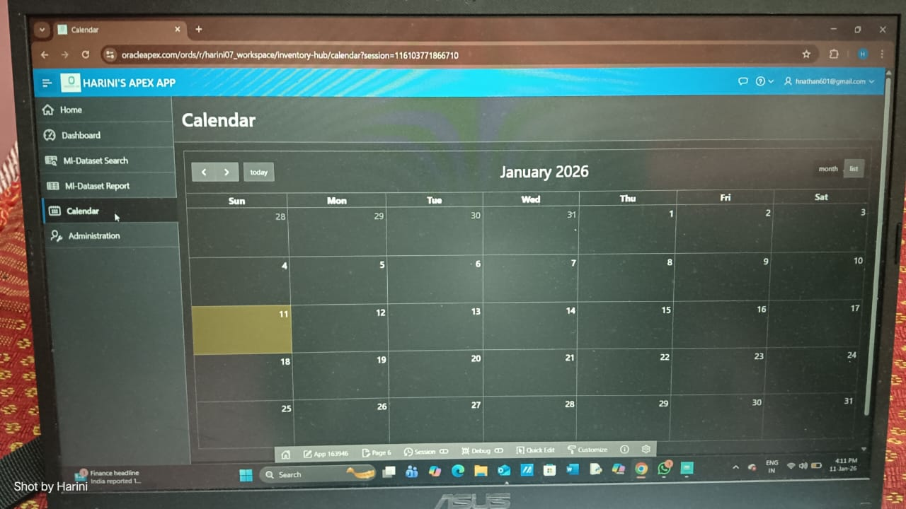

# 📊 Inventory Hub - Web Application

### 📌 Project Overview
A web-based application built to manage and visualize inventory datasets. 
This project demonstrates how to take external data and present it through a professional user interface.

### 🚀 Key Features
- **Interactive Dashboards:** Visual summary of inventory levels.
- **Reporting Modules:** Searchable and filterable data tables.
- **Calendar Integration:** A dedicated view for tracking date-based inventory records.
- **Data Source:** Utilized datasets sourced from online repositories to simulate real-world scenarios.

### 🛠️ Built With
- **Oracle APEX:** For the web interface and logic.
- **SQL:** For database management and reporting queries.

### 📸 Preview

**Login Page**

**Home Page**

**Main Dashboard**

**Inventory Report**

**Inventory Search**

**Calendar View**

